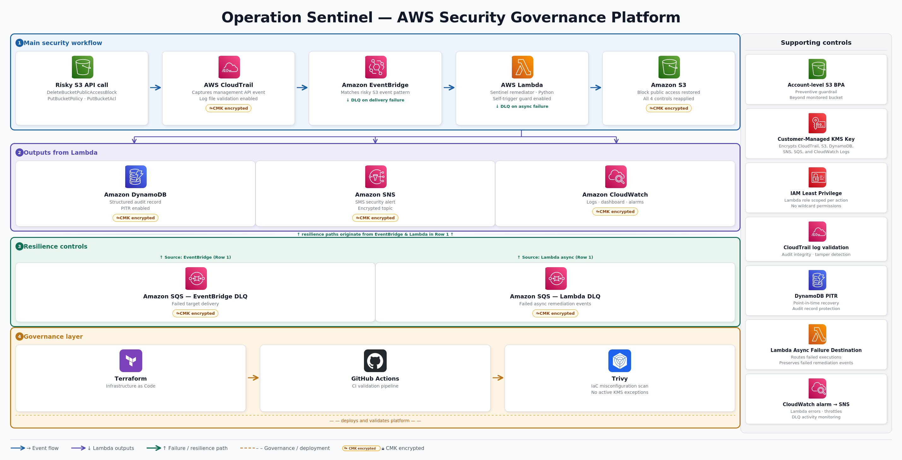

# Operation Sentinel: AWS Security Governance Platform

An event-driven AWS security governance system that detects risky S3 public access changes and remediates them automatically.

---

## Problem

Cloud environments move faster than manual security review. A single `DeleteBucketPublicAccessBlock` call can expose sensitive storage before a human notices. For regulated environments, delayed remediation creates operational risk, audit exposure, and potential compliance failure.

## Solution

Operation Sentinel closes that gap with an automated control loop: detect → remediate → audit → alert → validate.

The system detects risky S3 public access changes, restores the required storage guardrail, records structured audit evidence, sends an SMS alert, and provides operational visibility through CloudWatch. The infrastructure is deployed through Terraform and validated through CI security checks before promotion.

---

## Architecture



```text
Risky S3 API call
→ CloudTrail captures the event
→ EventBridge matches the S3 risk pattern
→ Lambda restores S3 Block Public Access
→ DynamoDB records audit evidence
→ SNS sends an SMS alert
→ CloudWatch provides logs, alarms, and dashboard visibility
```

---

## Stack

| Layer | Service |
|---|---|
| Detection | AWS CloudTrail, Amazon EventBridge |
| Remediation | AWS Lambda |
| Storage Governance | Amazon S3 Block Public Access |
| Audit | Amazon DynamoDB |
| Alerting | Amazon SNS SMS |
| Observability | Amazon CloudWatch Logs, Dashboard, Alarms |
| Resilience | Amazon SQS DLQs, EventBridge retry policy, Lambda async failure destination |
| Encryption | AWS KMS customer-managed key |
| Governance | Terraform, GitHub Actions, Trivy, OPA/Rego policy examples |

---

## Detection

CloudTrail captures management-plane API activity. EventBridge matches security-relevant S3 events:

- `DeleteBucketPublicAccessBlock` *(primary validated trigger)*
- Bucket policy modifications
- ACL changes

CloudTrail log file validation is enabled to support audit integrity and tamper detection for the underlying log stream.

---

## Remediation

The Lambda responder extracts the affected bucket from the CloudTrail event and reapplies all four S3 Block Public Access controls:

```python
BlockPublicAcls       = True
IgnorePublicAcls      = True
BlockPublicPolicy     = True
RestrictPublicBuckets = True
```

The execution role is scoped to the permissions required to remediate the monitored bucket, write audit records, publish alerts, use the customer-managed KMS key, and log execution.

The function also includes a self-trigger guardrail to reduce the risk of remediation loops if event patterns are expanded later.

---

## Observability

- **CloudWatch Logs** — KMS-encrypted structured execution output per remediation event
- **DynamoDB** — KMS-encrypted audit records with event ID, timestamp, bucket name, event name, and remediation outcome
- **SNS SMS** — immediate security notification on remediation trigger
- **CloudWatch Dashboard** — centralized visibility into remediation activity
- **CloudWatch Alarms** — monitoring for Lambda errors, Lambda throttles, and DLQ activity

---

## Resilience

Operation Sentinel includes failure-handling controls so remediation events are not silently lost.

- Lambda asynchronous failure destination routes failed remediation events to an SQS DLQ
- EventBridge target includes retry behavior and a dedicated SQS DLQ
- SQS DLQs use customer-managed KMS encryption
- DynamoDB point-in-time recovery protects remediation audit records
- Account-level S3 Block Public Access provides a preventive guardrail beyond the monitored bucket

---

## Encryption Governance

Operation Sentinel uses a customer-managed AWS KMS key to protect security telemetry and audit data across the platform.

The KMS key is used for:

- CloudTrail log encryption
- S3 bucket encryption
- SNS alert encryption
- SQS DLQ encryption
- DynamoDB audit table encryption
- CloudWatch log group encryption

This provides centralized encryption governance for the system’s audit trail, alerting path, failure-handling path, and remediation evidence.

---

## Governance

The full platform is defined in Terraform. The GitHub Actions CI workflow validates the infrastructure code through:

1. `terraform fmt` — format validation
2. `terraform init` + `terraform validate` — configuration integrity
3. `trivy` — infrastructure-as-code security scanning through `policies/trivy.yaml`

The repository also includes OPA/Rego policy examples in `policies/opa/terraform-security.rego` to document governance intent for S3 public access and CloudWatch retention controls.

Trivy is the active scanner in the current CI workflow. The Rego policies are structured for future Conftest integration.

---

## Validation

The remediation workflow was validated by intentionally invoking `DeleteBucketPublicAccessBlock` on the monitored bucket.

**Result:**

```text
remediation_status = success
```

EventBridge matched the CloudTrail event, Lambda restored all four S3 Block Public Access settings, DynamoDB recorded the structured audit entry, SNS delivered the SMS notification, and CloudWatch displayed the remediation activity.

Post-hardening validation confirmed that the platform continued to remediate successfully after adding audit integrity, failure handling, customer-managed KMS encryption, account-level S3 guardrails, and operational alarms.

---

## Security Design Principles

- Event-driven detection — no polling or scheduled checks
- Automated remediation — known violations are corrected without manual intervention
- Least-privilege IAM — scoped permissions for remediation, audit, alerting, logging, and KMS usage
- Structured audit evidence — DynamoDB records preserve remediation outcomes
- Customer-managed encryption — KMS protects CloudTrail logs, S3 storage, SNS alerts, SQS DLQs, DynamoDB audit records, and CloudWatch logs
- Audit integrity — CloudTrail log file validation enabled
- Preventive guardrails — account-level S3 Block Public Access
- Failure handling — Lambda async failure destination and EventBridge DLQ
- Operational monitoring — CloudWatch alarms for remediation health
- IaC-only infrastructure — no manual console provisioning
- CI/CD security validation — Terraform validation and Trivy scanning before promotion

---

## Scope and Limitations

This implementation targets a single AWS account and one monitored S3 bucket. It is intentionally scoped as a focused, demonstrable security control rather than a full organizational rollout.

This implementation uses a customer-managed AWS KMS key to encrypt security telemetry and audit data across CloudTrail, S3, SNS, SQS, DynamoDB, and CloudWatch Logs.

Lambda reserved concurrency was evaluated as a runtime safety control but was not enabled due to account-level concurrency quota constraints. It remains a recommended production enhancement after quota validation or increase.

Production expansion paths include AWS Config custom rules, Security Hub integration, IAM privilege escalation detection, multi-account deployment through AWS Organizations, centralized log archive accounts, and organization-level SCP guardrails.

---

## Repository Structure

```text
aws-security-governance-sentinel/
├── .github/
│   └── workflows/
│       └── security-iac.yaml
├── architecture/
│   └── operation-sentinel-architecture.png
├── infra/
│   ├── cloudtrail.tf
│   ├── cloudwatch.tf
│   ├── dynamodb.tf
│   ├── eventbridge.tf
│   ├── iam.tf
│   ├── kms.tf
│   ├── lambda.tf
│   ├── outputs.tf
│   ├── providers.tf
│   ├── s3.tf
│   ├── sns.tf
│   ├── sqs.tf
│   ├── terraform.tfvars.example
│   └── variables.tf
├── lambda/
│   └── sentinel_remediator.py
├── policies/
│   ├── opa/
│   │   └── terraform-security.rego
│   └── trivy.yaml
├── validation-screenshots/
├── .gitignore
├── .trivyignore
└── README.md
```

---

## Project Outcome

Operation Sentinel demonstrates a hardened AWS security governance pattern using native cloud services and Infrastructure as Code.

The project validates practical experience with:

- CloudTrail-based security event detection
- EventBridge-driven automation
- Lambda-based remediation
- S3 public access governance
- IAM least privilege
- Customer-managed KMS encryption
- DynamoDB audit logging and point-in-time recovery
- SNS SMS alerting
- KMS-encrypted SQS dead-letter queues
- CloudWatch observability and alarms
- Terraform infrastructure deployment
- GitHub Actions CI validation
- Trivy IaC scanning
- OPA/Rego policy-as-code structure
